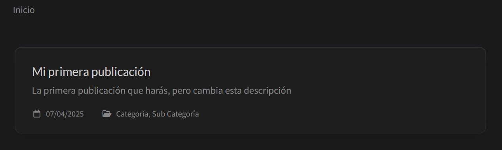
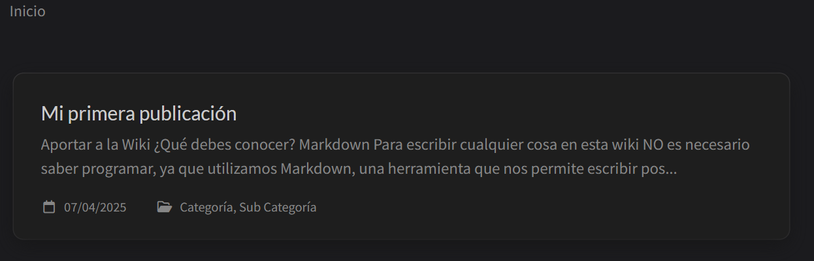
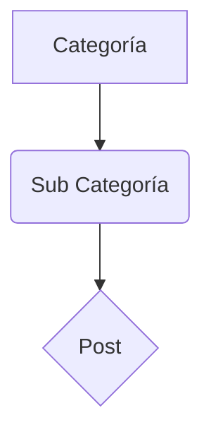
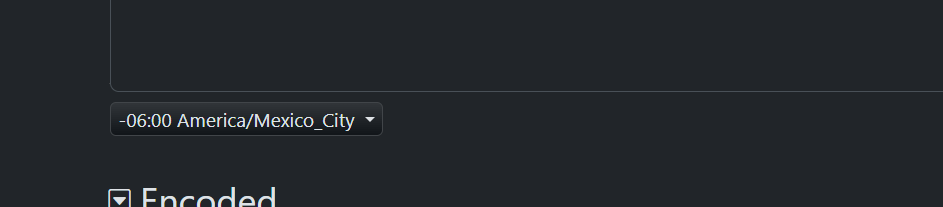

# Aportar a la Wiki

## ¿Qué debes conocer?

### Markdown

Para escribir cualquier cosa en esta wiki **NO es necesario saber programar**, ya que utilizamos [Markdown](https://markdown.es), una herramienta que nos permite escribir posts en un formato sencillo de leer y sin necesidad de escribir líneas de código ni de estilo.

Markdown tiene una sintásis sencilla (que puedes ver [en este link](https://markdown.es/sintaxis-markdown/) o investigando sobre Markdown), por lo que no lo explicaremos en este post.

### Chirpy

Esta wiki se basa en [Chirpy](https://chirpy.cotes.page), un tema para páginas basadas en J... bla bla bla, eso no es importante, lo importante es que Chirpy tiene su propia documentación para escribir posts, la cual puedes encontrar [en este link](https://chirpy.cotes.page/posts/write-a-new-post/), ahí puedes ver los pasos para escribir un post.

### Si quieres hacer test local

> **NO** es necesario que hagas test local de tus posts, nosotros podemos hacer el test cuando nos mandes tu post y nos encargaremos de verificar que (estéticamente) se vea bien, pero si te interesa la programación en general, aprender a hacer algo como esto podría ser muy útil para tu vida de developer ;)
{: .prompt-info }

Si quieres hacer test local de tus posts (y hacerlas de la misma forma que el equipo de Nyxis), también tendrás que usar:
- [Github](https://github.com), sea usando [Git CLI](https://git-scm.com/book/en/v2/Getting-Started-The-Command-Line) o [Github Desktop](https://github.com/apps/desktop)
- [Visual Studio Code](https://code.visualstudio.com)
- [Docker Desktop](https://www.docker.com/products/docker-desktop/)
- [Jekyll + Ruby Gems](https://jekyllrb.com/docs/installation/windows/)
- [Jekyll-Compose](https://github.com/jekyll/jekyll-compose) (no necesitas instalarlo, ya que se incluye con nuestro repositorio).

No es necesario que aprendas nada de Docker porque este será configurado automáticamente por VSCode, por otro lado, sí sería buena idea aprender por lo menos lo general de Github, VSCode y Jekyll-Compose para que sea más fácil escribir tus posts.

## Con Test local

Si hacer test local es mucho trabajo para ti, ve a la siguiente sección: [Sin test local](#sin-test-local).


La siguiente información está basada en la [documentación de chirpy](https://chirpy.cotes.page/posts/getting-started/#using-dev-containers-recommended-for-windows).

> Si decides hacer test local, primero asegúrate de tener las cosas enlistadas en los [requisitos para test local](#si-quieres-hacer-test-local).
{: .prompt-danger }

Una vez que tengas todo lo necesario instalado, sigue estos pasos:
1. Abre VScode
2. Instala la [extensión Dev Containers](https://marketplace.visualstudio.com/items?itemName=ms-vscode-remote.remote-containers) en tu VSCode 
3. Clona el [repositorio de Wiki Nyxis](https://github.com/NyxisNet/Wiki)
4. Abre en VSCode la carpeta donde se clonó el repositorio (puedes arrastrar la carpeta a la ventana de VSCode para abrirla automáticamente)
5. Al abrir la carpeta, VSCode debería dar una notificación de abrir la carpeta como un `docker container` (o algo similar), hay que aceptar eso.
6. Esperar a las instalaciones de docker.
7. Ejecutar `bundle exec jekyll s` para ver la página de la wiki en local.

Si todo funcionó bien, VSCode debería darte una notificación de que se está ejecutando la aplicación en un puerto (por ejemplo: puerto 4000), puedes abrir la visualización de la web en tu navegador yendo al link `localhost:puerto` (para el ejemplo de puerto 4000, sería `localhost:4000`) o haciendo `Ctrl + Click` en el link que aparece en la terminal inferior de VSCode.

Si decides hacer tests locales, tendrás la ventaja de poder utilizar [Jekyll-Compose](https://github.com/jekyll/jekyll-compose#usage), no necesitas instalarlo porque ya viene incluido con nuestro repositorio, pero puedes ver el link previamente vinculado para entender cómo utilizarlo, esto te facilitará el manejo de fechas, horas y zonas horarias en tus posts.

## Sin test local

> Recomendamos que consideres [hacer tests locales](#con-test-local) de tus posts, si lo haces de esta forma, tú podrás ver cómo se verá tu post en la Wiki Nyxis oficial, podrás escribir más rápidamente tus posts y además nos facilitarás al equipo de Nyxis aceptar tus posts más rápidamente.
{: .prompt-tip }

Si no deseas hacer tests locales de tus posts, no podrás subirlas directamente a Github para que las revisemos, **pero** eso no significa que no puedas aportar a la Wiki, ya que podemos revisar tus posts manualmente.

Simplemente escribe tu post en tu editor de texto favorito, siguiendo la información para [escribir tu primer post](#tu-primer-post) y una vez que hayas terminado, sigue [los pasos finales](#pasos-finales).

## ¿Qué se puede hacer?

**MUCHAS** cosas, realmente muchas, ya que nuestra wiki está basada en Chirpy y Jekyll, que son herramientas que ayudan a la creación de publicaciones sin necesidad de código.

Este post es un ejemplo de varias cosas que se pueden hacer con estas herramientas, como tips, info, listas, títulos, subtítulos, tablas de contenido, links, formato de texto, entre otras cosas, pero Chirpy y Jekyll tienen mucho más potencial (espero que usen mucho de eso en otras publicaciones).

Puedes encontrar información sobre Chirpy [aquí](https://chirpy.cotes.page/posts/text-and-typography/) y sobre Jekyll [aquí](https://jekyllrb.com/docs/posts/).

## Reglas para aportar

1. **Usar correctamente Markdown** para definir títulos, subtítulos, listas, enlaces y formato general.
   - Evita estilos inconsistentes o desordenados.
   - Utiliza encabezados jerárquicamente (por ejemplo, `##` para subtítulos bajo un `#`).

2. **No incluir scripts de ningún tipo sin previa autorización**.
   - Si tu publicación requiere un script por razones justificadas, debes informarlo al momento de hacer la petición de publicación.

3. **No crear variaciones de etiquetas (tags) o categorías previamente existentes**.
   - Por ejemplo, si ya existe una categoría llamada `Survival`, no crees otra llamada `survival` o `SURVIVAL`.
   - Usa las etiquetas existentes y consulta la lista actual antes de crear nuevas.

4. **Los nombres de tags deben ser en minúsculas**.  
   - Esto mantiene consistencia y facilita su búsqueda.
   - No uses mayúsculas ni variantes del mismo tag.

5. **Usar lenguaje apropiado, claro y respetuoso en todas las publicaciones**.
   - No se permite contenido ofensivo, vulgar o que falte al respeto a otros.
   - Evita modismos locales que puedan dificultar la comprensión general.

6. **Mantener una redacción clara y con buena ortografía**.
   - Asegúrate de que tu publicación sea fácil de leer y entender.
   - Usa herramientas de revisión si es necesario antes de enviar el contenido.

7. **Evitar contenido duplicado o muy similar a publicaciones anteriores**.
   - Si deseas actualizar una publicación existente, modifícala en lugar de crear una nueva.

8. **Aportar contenido original o correctamente referenciado**.
   - Si utilizas fragmentos de otras fuentes, indícalo claramente y da crédito cuando corresponda.

9.  **No uses imágenes demasiado pesadas ni en formatos poco comunes**.
   - Se recomienda comprimir las imágenes y usar formatos como `.jpg`, `.png` o `.webp`.

10. **Revisa el contenido visual (imágenes, videos, etc.) antes de subirlo**.
   - Asegúrate de que no incluya marcas de agua no deseadas, datos personales o elementos innecesarios.

---

> Al contribuir con contenido, aceptas estas reglas, la [licencia del repositorio](https://github.com/NyxisNet/Wiki/blob/main/LICENSE) y entiendes que las publicaciones pueden ser editadas para adaptarse a los estándares de calidad del sitio.

## Tu primer post

Lo primero que debes saber sobre tu post es que debe ser un archivo tipo markdown, por lo tanto debe tener extensión `.markdown` o `.md` (*.md* suele ser más usada).

> ### PRO TIP:
Si decidiste hacer tus posts usando [tests locales](#con-test-local), puedes revisar [cómo usar Jekyll-Compose](https://github.com/jekyll/jekyll-compose#usage) para facilitar la creación de borradores (drafts) y convertirlos en publicaciones (posts). Es muy recomendable revisar la documentación relacionada antes de iniciar con tu primer post para saber qué pasos de este tutorial aplican para ti.
{: .prompt-tip }

Lo primero que debes agregar a tu documento es el [Front Matter](https://jekyllrb.com/docs/front-matter/), en específico el layout y el título, de la siguiente forma:

```yaml
---
layout: post
title: Mi primera publicación
---
```

- `layout` le dirá a Wiki Nyxis que el documento es un post (en general no deberías cambiar eso nunca).
- `title` le dirá a Wiki Nyxis cuál es el título que se mostrará en otras partes de la Wiki cuando se vea tu post.

Estas dos primeras configuraciones son las más importantes, pero hay otras importantes que se tienen que incluir, este es un ejemplo completo:

```yaml
---
layout: post
title: Mi primera publicación
description: La primera publicación que harás, pero cambia esta descripción
categories: [Categoría, Sub Categoría]
tags: [tag, tag2]
date: YYYY-MM-DD HH:mm:SS +/-TTTT
authors: [eltacodev]
---
```

- `description` da una descripción al post para resumir el contenido cuando se vea el post en la lista de contenidos de la página de inicio, si no se define esto, en vez de una descripción se verá directamente el contenido del sitio en una forma mal presentable, por lo que es muy recomendable incluirlo
  
  _Publicación sin descripción_
  
  _Publicación CON descripción_
- `categories` define las categorías **y subcategorías** a las que este post pertence, en este ejemplo, el post pertenecería a `Categoría` como categoría principal y dentro de esta, estaría `Sub Categoría`, donde se encuentra este post, viéndose así:
  


- `tags` define las etiquetas que identifican a este post, a diferencia de las categorías, estas no tienen orden específico y no se procesan como "sub etiquetas", cada etiqueta es individual y se pueden tener varias para identificar de varias formas un mismo post.
- `date` define la hora de la publicación del post, `YYYY` es el año, `MM` es el mes (1-12), `DD` es el día, `HH` es la hora, `mm` es minutos, `SS` es segundos y `+/-TTTT` es la diferencia con UTC que tiene tu zona horaria, por lo que un mejor ejemplo sería: `date: 2025-04-07 19:22:30 -0600` (que es la hora en la que se escribe este tutorial)

Para encontrar tu diferencia de hora: [usa esta herramienta](https://dencode.com/date/rfc2822)
`date: 2025-04-07 11:13 -0600`, simplemente selecciona tu país de la lista despleglable y mira qué diferencia de hora tiene, quita los `:` y ese es el `+/-TTTT` que debes poner.


_Lista despleglable de países de [dencode.com](https://dencode.com/date/rfc2822)_

<a name="authors-brief" href="#"></a>
- `authors` especifica los ID de los autores del post, originalmente solo debería incluirte a ti, pero no escribas directamente tu nombre porque así no es como funciona, hablaremos de esto más adelante en [el tema de créditos](#créditos)

Una vez que tengas tu Front Matter completo, puedes empezar a escribir tu post tal y como lo tenías imaginado :D

Toma en cuenta la documentación de [Chirpy](https://chirpy.cotes.page/posts/write-a-new-post/) y [Markdown](https://daringfireball.net/projects/markdown/) para escribir tu post con un formato limpio y consistente, siempre siguiendo las [reglas para aportar](#reglas-para-aportar).

Cuando hayas terminado de escribir, querrás tener el crédito de tu creación, para saber sobre eso, ve al siguiente tema.

## Créditos

Wiki Nyxis quiere promover que los escritores de contenido para la wiki sean reconocidos por sus aportes, por lo que aprovechamos el sistema de autoría de Chirpy para dar créditos a los autores del contenido subido a nuestra wiki.

### ¿Cómo me incluyo como autor de un post?

Primero tienes que agregar tu información al archivo [authors.yml](../_data/authors.yml) (este link solo sirve en VSCode), los autores encontrados en este archivo siguen el siguiente formato:

```yaml
ID:
  name: TuNombre
  url: https://google.com/
  otra-cosa: Algo más que quieras incluir
```

- `ID` (el primer texto) es el identificador del autor que se usará en el Front Matter del post, este <ins>no será visible para el lector</ins>, pero debe tener únicamente letras (a-Z) y números (0-9) para asegurar consistencia entre IDs y estabilidad al momento de parsear el contenido de la página.
- `name` es el nombre que se mostrará en la parte inicial de tu post y en la lista de publicaciones de la Wiki, este es el texto que el lector podrá ver al encontrarse con tu post.
- `url` es el link que se abrirá cuando alguien haga click en tu nombre, por seguridad de los lectores, **debe ser https** y previamente revisado por un administrador.

Tu información como autor está en formato [YAML](https://www.ibm.com/mx-es/topics/yaml), por lo que si gustas añadir otras redes relacionadas a ti, no tenemos problema, pero queda a nuestra discreción el aceptar, modificar o rechazar cualquier vínculo e información que se incluya aquí.

Una vez que hayas terminado de escribir tu información de autor, puedes [agregar tu ID a tu Front Matter](#authors-brief), dentro de la lista de autores, aquí tienes un ejemplo completo de información de autor y Front Matter:

### Ejemplo

_Información de autor de ElTacoDev:_
```yaml
# <- En documentos YAML, los textos que inician con "#" son comentarios.
eltacodev: # ID que se agrega en el Front Matter
  name: ElTacoDev # Nombre que se muestra en la Wiki
  url: https://github.com/eltacodev # Link que se abre al dar click en el nombre del autor
  discord: eltacodev # Texto que el autor decidió añadir pero no se usa en la Wiki
```

_Front Matter:_
```yaml
---
layout: post # No es necesario poner esto, pero muy recomendable por posibles futuros planes de la Wiki.
title: Aportar a la Wiki
description: Proceso, reglas, tips e información necesaria para aportar a Wiki Nyxis.
date: 2025-04-07 11:11 -0600 # Zona horaria = America/Mexico_City
categories: [Wiki, Contenido] # Categorías capitalizadas (Primero mayúscula y luego minúsculas)
tags: [reglas, contenido, wiki, nyxis] # Tags siempre en minúsculas
mermaid: true # Para habilitar gráficos mermaid
authors: [eltacodev] # Lista de autores, incluso si solo es un autor ("authors" en vez de "author")
image: # Imagen de la miniatura y portada del post
  path: ../assets/aportar-a-la-wiki/mini.png # Ubicación de la imagen, puede ser relativa (archivo) o por CDN, pero nosotros no usamos CDN... por ahora.
  alt: "Miniatura del post c:" # Subtítulo de la imagen
permalink: "/aportar" # Solo administradores pueden definir posts con permalinks
---
```

> **Si no haces tests locales** simplemente escribe tu información de autor en el formato correcto y nosotros nos encargaremos de subir al documento de autores de la Wiki.
{: .prompt-info }

## Pasos finales

Ya, no hay más, ¡felicidades! hiciste tu primer post... aunque todavía falta realmente publicarlo...

### Si hiciste tests locales

En este caso, asumiré que tienes cuenta de github, por lo que puedes facilitar el proceso de publicación de tu post creando una [Pull Request](https://docs.github.com/es/pull-requests/collaborating-with-pull-requests/proposing-changes-to-your-work-with-pull-requests/creating-a-pull-request) (PR), en tu PR se discutirán los cambios que se necesiten para publicar tu post.


### Si no hiciste tests locales

Una vez que hayas terminado tu post, [abre un ticket en nuestro Discord](https://discord.com/channels/853771460266295326/1089652812515905556) (link para nuestro discord: http://discord.nyxis.net), coméntale al Staff que tienes un post para la Wiki y mándanos tu archivo `.md` o `.markdown` directamente a ese chat, el staff se encargará de revisarlo.

- Si tu post requiere cambios simples, podemos hacerlos nosotros, pero esto podría significar que el staff que haya hecho los cambios se agregue como co-autor(s) del post, si no quieres que sea así, menciónalo desde el principio de tu ticket y nosotros te diremos qué cambios necesitamos que tú hagas.

- Si tu post requirere cambios complejos o por alguna razón no podemos aceptarlo, te haremos saber la razón y de ser posible, te pediremos que hagas los cambios necesarios para poder continuar con la publicación de tu post.

- Si tu post no requiere ningún cambio, será aceptado por el staff y un administrador de la wiki se encargará de subirlo a Wiki Nyxis para que toda la comunidad pueda verlo, una vez que se haya subido, se te avisará por medio del mismo ticket o DM.

Recuerda enviarnos tu información de autor en el [formato correcto](#cómo-me-incluyo-como-autor-de-un-post) y nosotros nos encargaremos de subir al documento de autores de la Wiki.
